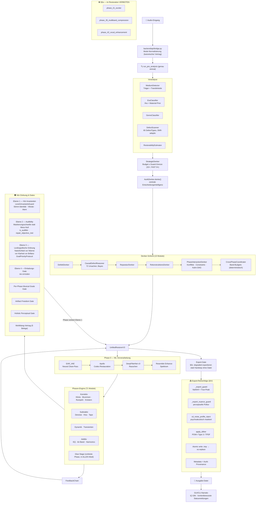
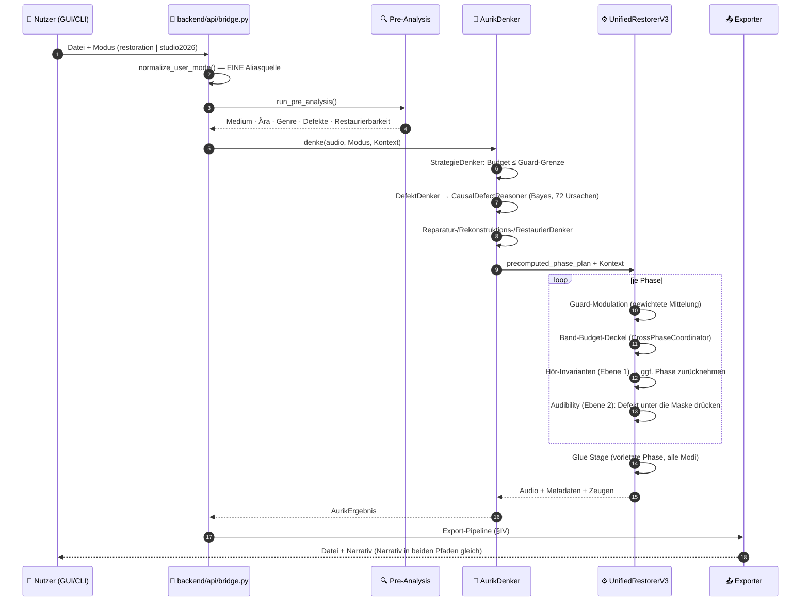

# Aurik 10 — Architektur-Überblick

**Stand:** 2026-10-07
**Version:** 10.11.0
**Status:** RELEASE_MUST-konform | §v10 Pleasantness-First aktiv | Hör-Gates Ebenen 1/2/4 aktiv

> Verbindlicher Wahrheitsstand (normative Kette, `AGENTS.md` §1): `.github/copilot-instructions.md` →
> `.github/VERBOTEN.md` → `.github/instructions/` (hoerordnung + Domain) → `.github/specs/`
> (Index: `00_SPEC_INDEX.md`) → `CLAUDE.md`.

## Kernprinzip (§v10)

**Aurik optimiert JEDEN individuellen Song autonom.** Kein blinder Material-Glaube,
keine statischen Schwellwerte ohne Messung. Die Tonträgerkette, das gemessene SNR,
das tatsächliche Spektrum und die harmonische Dichte des Songs bestimmen ALLE
Parameter — nicht der erkannte Materialtyp allein.

## Kernzahlen (am Code gemessen, 2026-10-07)

- **71 Phasen-Module** (`backend/core/phases/phase_*.py`); im Restoration-Modus sind
  `phase_21_exciter`, `phase_35_multiband_compression` und `phase_42_vocal_enhancement`
  **normativ verboten** (§0a (copilot-instructions.md))
- **65 DefectTypes** (DefectScanner) — alle SNR-adaptiv
- **72 Kausal-Ursachen** (CausalDefectReasoner) — `CAUSES`/`LIKELIHOOD_FNS`/`CAUSE_TO_PHASES`
  sind 72/72/72 synchron; Spec 06 §7.2 ist die Spiegel-Liste (Code ⇄ Spec per Gate erzwungen)
- **13 Denker-Module** (`denker/`) — Orchestrierung, Strategie, Defekt, Reparatur,
  Rekonstruktion, Restaurierung, Exzellenz, Phasen-Interaktion, Cross-Phase,
  Tonträger, Tonträgerkette, Perceptual Council, `__init__`
- **16 Träger-Materialien** (`MaterialType`) — Priors für 17 Schlüssel in `MATERIAL_PRIORS`
  (inkl. `unknown`)
- **15 Musical Goals** (Spec 01) + 2 vokal-exklusive P0-Gates
- **Hör-Gates Ebenen 1/2/4** (`level_1_invariants_guard`, `defect_audibility_gate`,
  `vocal_overdrive_guard`, `einladungs_gate`)
- **Budget-Wahrheit:** harter Guard **32× RT** (FAST **8×**, §2.38 KMV), gemessene Ist-Lage
  der Voll-Pipeline **~53× RT** (Matrix-Endlauf 2026-09-07/08). Die Lücke ist Performance-Arbeit
  (TODO-P0-1: Analytik/End-Gate von per-Chunk auf Song-Ebene), kein Planungsziel —
  das Plan-Budget ist auf die Guard-Grenze gedeckelt
- **~18.400 Tests** (511 mit Markern)

## Kanonischer Release-Vertrag

```text
Audio-Import  -> backend.api.bridge.get_load_audio_fn()
Voranalyse    -> backend.api.bridge.run_pre_analysis() genau einmal
Pipeline      -> get_aurik_denker_instance().denke(...)
Modus         -> restoration | studio2026
Export        -> export_guard() + validate_export_quality() + AudioExporter
```

## Zentrale Komponenten

| Komponente | Zweck |
| --- | --- |
| `AurikDenker` | Kognitive Orchestrierung der Gesamtpipeline (Stufen 1–10) |
| `StrategieDenker` | Budgetplanung und Stufenwahl; Budget ist auf die Guard-Grenze gedeckelt |
| `DefektDenker` | Defekt-Detektion (65 Typen) + kausale Einordnung |
| `ReparaturDenker` | Chirurgische Vorab-Reparatur (Klicks, Brummen, Clipping) |
| `RekonstruktionsDenker` | Lücken-Schließung (Dropouts, Bandbreite) |
| `RestaurierDenker` | UV3-Instanz und Kern-Skalierung |
| `ExzellenzDenker` | 15-Goal-Bewertung + konservative Ziel-Reparatur **unter der lexikografischen Hörordnung** |
| `PhaseInteractionDenker` | Phasenplan: Konflikte, Constraints, Kahn-DAG, **zentrale Guard-Modulation** (Stärke) |
| `CrossPhaseCoordinator` | Kumulative Wirkung pro Frequenzband (2–8 kHz) deckeln; Reset je Song |
| `TontraegerDenker` / `TontraegerketteDenker` | Trägererkennung und Kettenableitung |
| `PerceptualQualityCouncil` | Holistisches Qualitätsurteil als **Zeuge** (ersetzt keine normative Formel) |
| `UnifiedRestorerV3` | Phase-Orchestrierung und Kontextsteuerung |
| `DefectScanner` | Defekt-Detektion (65 Typen) |
| `CausalDefectReasoner` | Kausalkette und Mapping auf Phasen (72 Ursachen) |
| `MusicalGoalsChecker` | 15-Goal-Bewertung |
| `HolisticPerceptualGate` | HPI/AFG/VQI-basierte Freigabelogik |
| Hör-Gates E1/2/4 | Level-1-Invarianten, Defect-Audibility, Vocal-Overdrive, Einladungs-Gate (`backend/core/dsp/`) |

## Datenfluss (vollständig)



## Kanonischer Pfad (GUI und CLI identisch, §G9 (copilot-instructions.md))



## Qualitäts- und Sicherheitsinvarianten

- `artifact_freedom < 0.95` blockiert Freigabe.
- Vokalpfad nutzt VQI als zusaetzlichen Recovery-Trigger.
- Kein paralleler Produktpfad ausserhalb des kanonischen Vertrags; GUI, CLI, REST und Batch
  durchlaufen denselben Pfad (Canonical-Contract-Drift-Gate).
- **Hörordnung Ebene 3 ist im Denker erzwungen:** `hearing_order_violation()` lehnt jeden
  Kandidaten ab, der ein höherrangiges Ziel für ein niederrangigeres senkt — auch bei
  positiver Gesamtbilanz.
- **§V8 Song-Isolation:** alle zustandstragenden Module werden je Song zurückgesetzt
  (u. a. `FallbackAuditor`, `CrossPhaseCoordinator`, Narrativ-Zähler).
- **§G5 Determinismus:** keine Zufalls-/Zeitquelle in Entscheidungen; Mengen werden
  sortiert iteriert, wo Fließkommawerte aufsummiert werden.
- **§0c Export-Vertrag:** Bei fehlgeschlagenem Export-Gate wird das bestmögliche sichere
  Ergebnis mit Status `degraded` exportiert — kein Hardstop ohne Datei.

## Produktgrenzen

- Desktop-only
- Offline-first
- Mono/Stereo als produktiver Zielpfad
- Keine Cloud-/Serverpflicht im Endnutzerbetrieb
